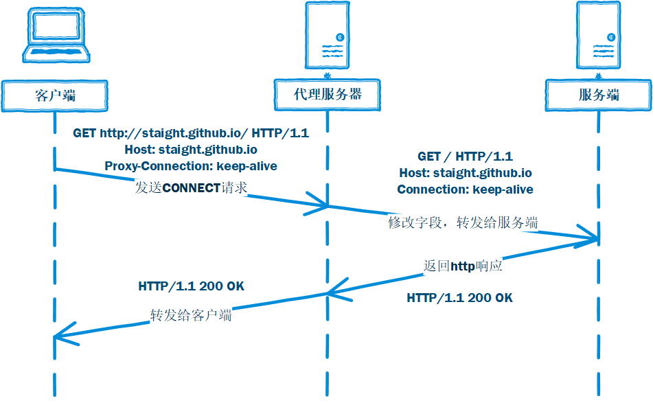
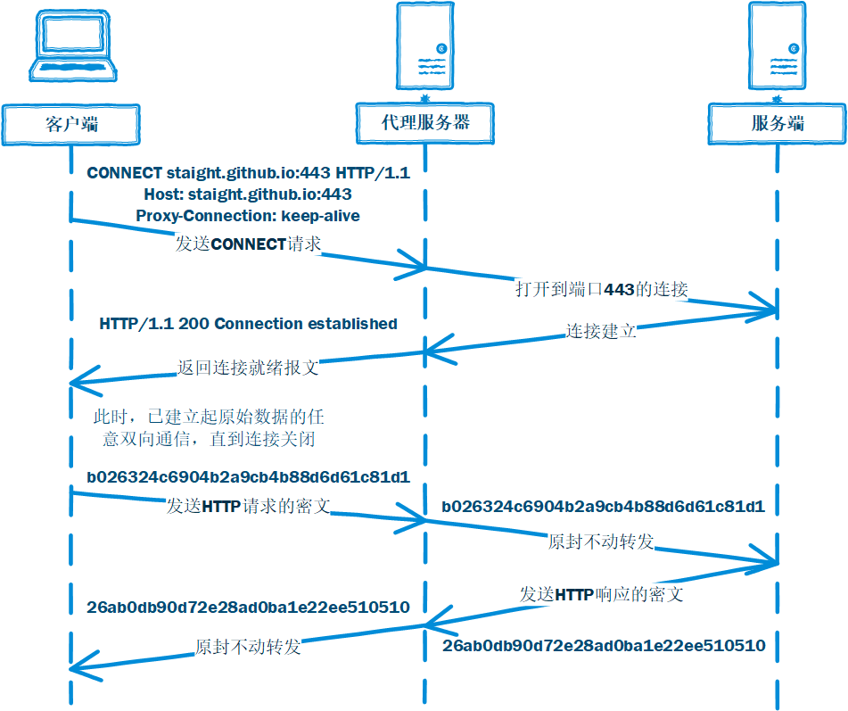

# 代理

代理是网络中的一项重要的功能，其功能就是代理网络用户去取得网络信息。形象的说：它是网络信息的中转站，对于客户端来说，代理扮演的是服务器的角色，接收请求报文，返回响应报文；对于web服务器来说，代理扮演的是客户端的角色，发送请求报文，接收响应报文。

代理具有多种类型，如果是根据网络用户划分的话，可以划分为正向代理和反向代理：

正向代理：将客户端作为网络用户。客户端访问服务端时，先访问代理服务器，随后代理服务器再访问服务端。此过程需客户端进行代理配置，对服务端透明。
反向代理：将服务端作为网络用户。访问过程与正向代理相同，不过此过程对客户端透明，需服务端进行代理配置（也可不配置）。
针对正向代理和反向代理，分别有不同的代理协议，即代理服务器和网络用户之间通信所使用的协议：

1. 正向代理： 
```
    http
    https
    socks4
    socks5
```

vpn：就功能而言，vpn也可以被认为是代理

2. 反向代理：
```tcp
    udp
    http
    https
```

## http代理

### http代理概述
http代理是正向代理中较为简单的代理方式，它使用http协议作为客户端和代理服务器的传输协议。

http代理可以承载http协议，https协议，ftp协议等等。对于不同的协议，客户端和代理服务器间的数据格式略有不同。

### http协议
我们先来看看http协议下客户端发送给代理服务器的HTTP Header：
```shell

// 直接连接
GET / HTTP/1.1
Host: staight.github.io
Connection: keep-alive

// http代理
GET http://staight.github.io/ HTTP/1.1
Host: staight.github.io
Proxy-Connection: keep-alive

```

可以看到，http代理比起直接连接：

1. url变成完整路径，/->http://staight.github.io/
2. Connection字段变成Proxy-Connection字段
3. 其余保持原样

为了兼容使用HTTP/1.0协议的过时的代理服务器。HTTP/1.1才开始有长连接功能，直接连接的情况下，客户端发送的HTTP Header中如果有Connection: keep-alive字段，表示使用长连接和服务端进行http通信，但如果中间有过时的代理服务器，该代理服务器将无法与客户端和服务端进行长连接，造成客户端和服务端一直等待，白白浪费时间。因此使用Proxy-Connection字段代替Connection字段，如果代理服务器使用HTTP/1.1协议，能够识别Proxy-Connection字段，则将该字段转换成Connection再发送给服务端；如果不能识别，直接发送给服务端，因为服务端也无法识别，则使用短连接进行通信。

### http代理流程图：



## https代理

接下来我们来看看https协议下，客户端发送给代理服务器的HTTP Header：
```shell

CONNECT staight.github.io:443 HTTP/1.1
Host: staight.github.io:443
Proxy-Connection: keep-alive

```
如上，https协议和http协议相比：

1. 请求方法从GET变成CONNECT
2. url没有protocol字段

实际上，由于https下客户端和服务端的通信除了开头的协商以外都是密文，中间的代理服务器不再承担修改http报文再转发的功能，而是一开始就和客户端协商好服务端的地址，随后的tcp密文直接转发即可。

### https协议

### https代理流程图：
